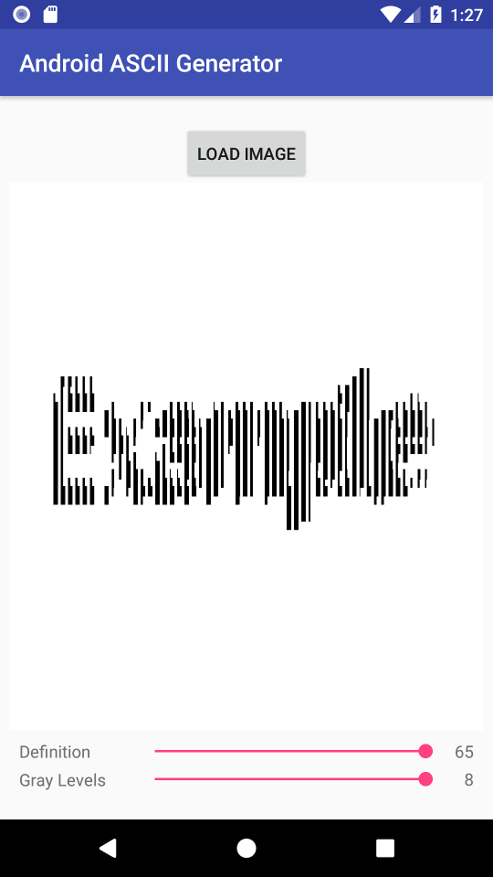

# AndroidASCIIGen
A small app that converts images into ASCII (Most specifically Unicode) art.

It's built using Kotlin and MVP architecture. 

**Features:**
* Custom font size / gray levels
* Custom characters used to draw the image can be added (directly into the code, through the `asciiArray` variable)

**Example:**

Input:

Output:

